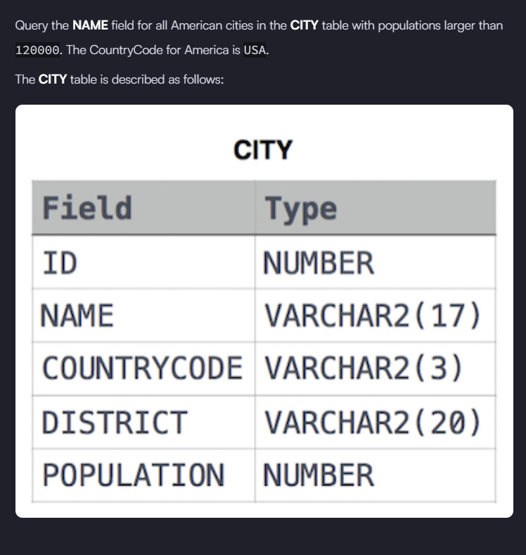
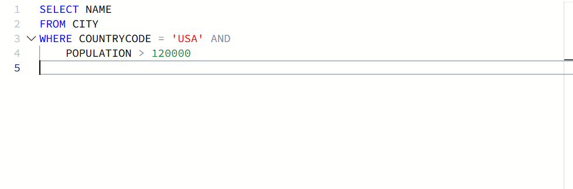

# 🧩 Revising the Select Query II – HackerRank

## 📝 Problem Statement


---

## ✅ Solution (Visual)


---

## 🧾 SQL Solution (Copy-Friendly)

```sql
SELECT NAME
FROM CITY
WHERE COUNTRYCODE = 'USA'
  AND POPULATION > 120000;
```

📌 This query is provided for easy copy, practice, and revision.

🧠 SQL Clauses Used & Explanation
🔹 SELECT
Used to specify which column(s) to retrieve from the table.

Why used here:
Only the NAME column is required as per the problem statement.

Interview angle:
Interviewers often ask the difference between selecting specific columns vs using SELECT *.

Common mistake:
Using SELECT * when only a single column is needed, leading to unnecessary data retrieval.

🔹 FROM
Specifies the table from which data is fetched.

Why used here:
All city-related data is stored in the CITY table.

Interview angle:
Tests understanding of basic SQL query structure.

🔹 WHERE
Filters rows based on specified conditions.

Why used here:
Used to filter only American cities (COUNTRYCODE = 'USA') with population greater than 120000.

Interview angle:
Frequently used to test filtering logic and execution order.

Common mistake:
Trying to use aggregate conditions inside WHERE instead of HAVING.

🔹 AND
Combines multiple conditions in the WHERE clause.

Why used here:
Ensures both country and population conditions are satisfied simultaneously.

Interview angle:
Tests logical condition handling in SQL.

Common mistake:
Incorrect use of OR instead of AND, which returns incorrect result sets.

🎯 Interview Questions & How to Answer
Q1. What is the difference between SELECT * and selecting specific columns?
Answer:
SELECT * retrieves all columns, whereas selecting specific columns fetches only required data, improving performance and readability.

Q2. Why is filtering done using the WHERE clause?
Answer:
The WHERE clause filters rows before they are selected, reducing the dataset early and improving efficiency.

Q3. Does the order of conditions in the WHERE clause matter?
Answer:
Logically no, but SQL optimizers may reorder conditions internally for better performance.

Q4. What would happen if OR was used instead of AND in this query?
Answer:
The query would return cities that are either in the USA or have a population greater than 120000, leading to incorrect results.

Q5. In what order does SQL execute this query?
Answer:

FROM

WHERE

SELECT

📌 Key Takeaways
- Always select only the columns you need
- Use WHERE to filter data as early as possible
- Understand logical operators (AND, OR) clearly
- Knowing execution order helps in SQL interviews and optimization
