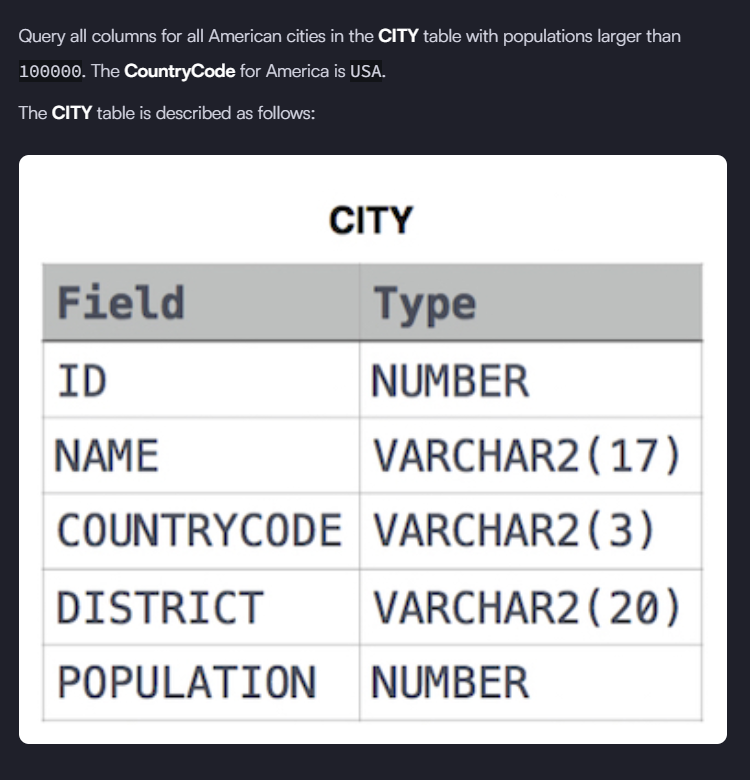
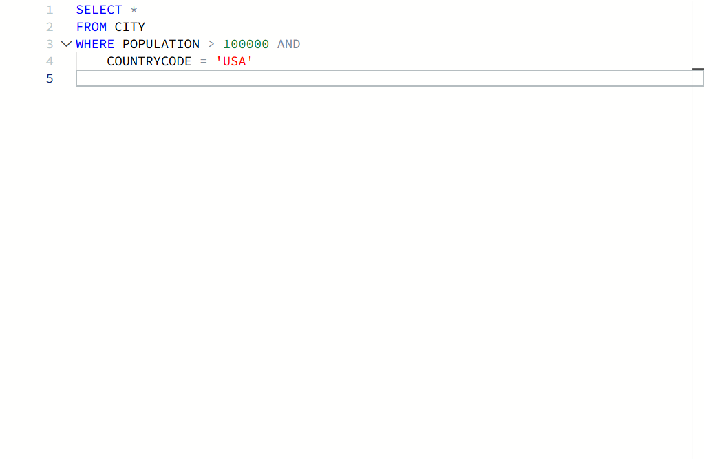

# 🧩 Revising the Select Query I – HackerRank

## 📝 Problem Statement


---

## ✅ Solution (Visual)


---

## 🧾 SQL Solution (Copy-Friendly)

```sql
SELECT *
FROM CITY
WHERE POPULATION > 100000
  AND COUNTRYCODE = 'USA';
