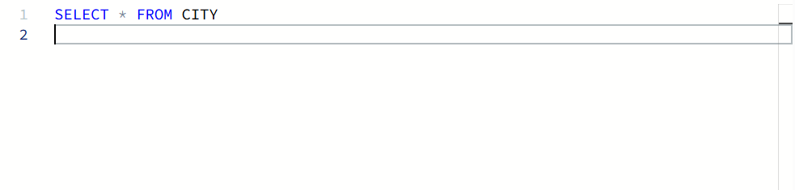

# 🧩 Select All – HackerRank

## 📝 Problem Statement


---

## ✅ Solution (Visual)


---

## 🧾 SQL Solution (Copy-Friendly)

```sql
SELECT *
FROM CITY;
```
# 🧠 SQL Clauses Used & Explanation

🔹 SELECT

Used to specify which columns to retrieve from the table.

Why used here:
The problem explicitly asks to retrieve all columns (attributes) from the CITY table.

Interview angle:
Interviewers often ask when SELECT * is appropriate and when it should be avoided.

Common mistake:
Using SELECT * in production queries when only a few columns are required.

🔹 FROM

Specifies the table from which data is fetched.

Why used here:
All required data resides in the CITY table.

Interview angle:
Tests basic understanding of SQL query structure.

# 🎯 Interview Questions & How to Answer

Q1. What does SELECT * do in SQL?

Answer:
It retrieves all columns from the specified table.

Q2. Why is SELECT * generally avoided in production queries?

Answer:
It fetches unnecessary columns, increases I/O cost, and may negatively impact query performance.

Q3. When is it acceptable to use SELECT *?

Answer:
It is acceptable during learning, debugging, or when all columns are explicitly required by the problem.

Q4. Does SELECT * affect query performance?

Answer:
Yes. Fetching unnecessary columns can increase memory usage and slow down query execution.

Q5. In what order does SQL execute this query?

Answer:

FROM

SELECT

# 📌 Key Takeaways

SELECT * retrieves all columns from a table

Use SELECT * cautiously in real-world applications

Always prefer selecting only required columns in interviews

Understanding execution order helps in optimization discussions
